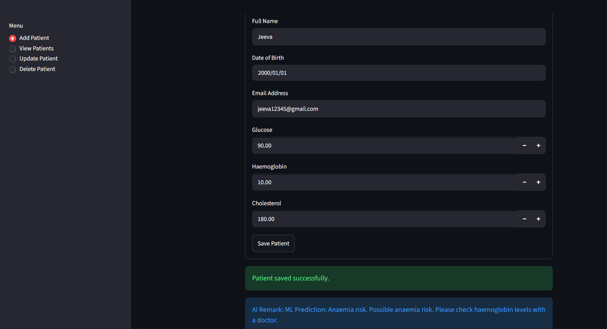
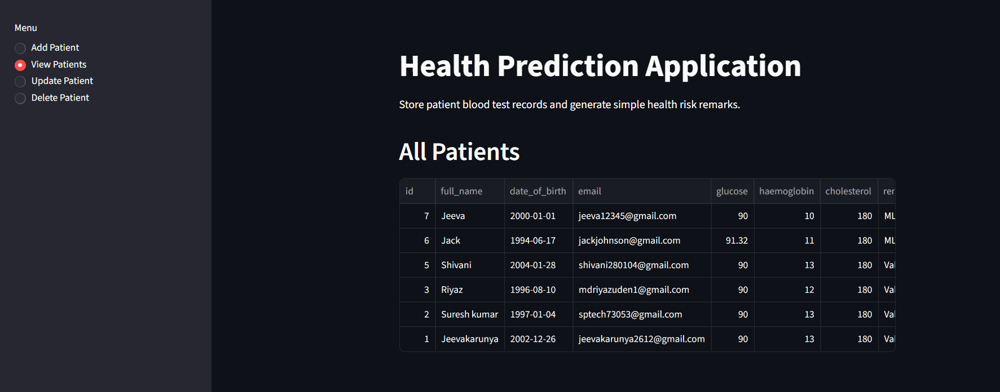

# Health Prediction Application

This is a simple Python and Streamlit project for the Junior AI/ML Developer Task 1.

## Features

- Add patient records
- View patient records
- Update patient records
- Delete patient records
- Validate basic input values
- Store records in SQLite
- Generate health remarks using a small custom ML model

## How To Run

Install packages:

```bash
pip install -r requirements.txt
```

Run the app:

```bash
streamlit run app.py
```

## Files

- `app.py` - Main Streamlit app and user interface
- `database.py` - SQLite database code
- `predictor.py` - Custom ML model and health remark prediction logic
- `requirements.txt` - Python packages needed to run the app

## Custom ML Model

The project uses a simple custom machine learning model written in Python.

The model compares the patient's glucose, haemoglobin, and cholesterol values with sample training records. It finds the closest matching sample and predicts one of these labels:

- Normal range
- Prediabetes risk
- Diabetes risk
- Anaemia risk
- Cholesterol risk
- Multiple risk indicators

This approach is similar to a basic K-Nearest Neighbour model.

## Application Screenshots

### Add Patient



### View Patient


## Note

This app gives basic screening remarks only. It is not a real medical diagnosis.
